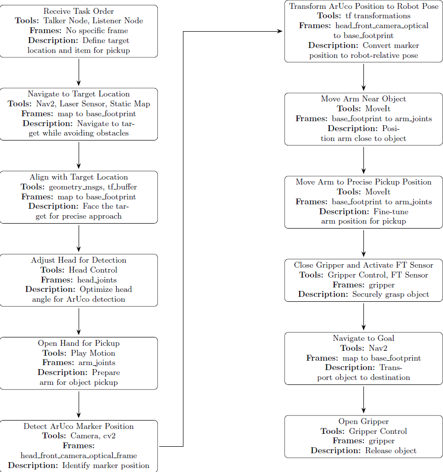
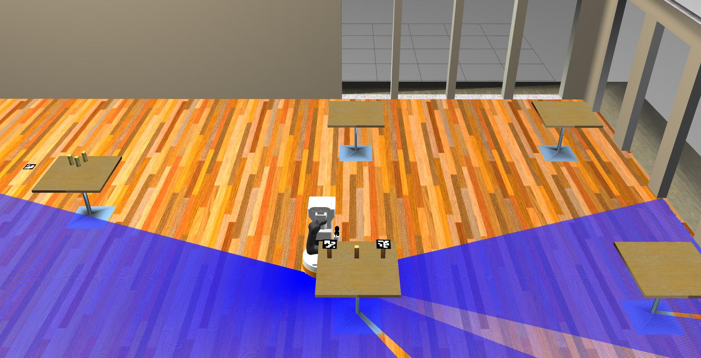

# TIAGo ROS 2 Simulation Service Robot

This project focuses on developing a service robot capable of advanced adaptability for tasks such as navigation and object handling in dynamic environments. Utilizing ROS 2 Humble and Gazebo, the robot dynamically adjusts its path and orientation based on real-time environmental feedback, ensuring precise alignment for object pickup and stable navigation around obstacles.

## Project Structure

The main components of this project are organized as follows:

- **`src/tiago_simulation/tiago_gazebo`**: This directory contains the primary simulation files for the TIAGo robot.

- **`src/tiago_simulation/tiago_gazebo/launch/tiago_gazebo.launch.py`**: This launch file initiates the Gazebo simulation environment with the TIAGo robot.

## Setup

### Prerequisites

1. Install ROS 2 Humble by following the [installation instructions](https://docs.ros.org/en/humble/Installation/Ubuntu-Install-Debians.html).

2. Update the apt package index and install needed packages

```console
sudo apt-get update

sudo apt-get install git python3-vcstool python3-rosdep python3-colcon-common-extensions
```


### Setting up the workspace

Create a workspace and clone all repositories:

```console
mkdir -p ~/tiago_public_ws
cd ~/tiago_public_ws
git clone https://github.com/DanNadler/Robotics.git .
```

Install dependencies using rosdep

```console
sudo rosdep init
rosdep update
rosdep install --from-paths src -y --ignore-src
```

Source the environment and build

```console
source /opt/ros/humble/setup.bash
colcon build --symlink-install
```

### Map Setup for Navigation in ROS 2 Humble

To ensure that the navigation system (Nav2) can properly load and use the required maps, follow the steps below:

 *Copy Map Files*  
   Locate the map files in your project's `maps` directory (or your preferred location) and copy them to a directory accessible by the navigation stack. For ROS 2 Humble, a typical location would be:  
   ```console
   /opt/ros/humble/share/pal_maps/maps/cafe_upgraded_11
   ```


## Simulation

Launch gazebo simulation:

```console
ros2 launch tiago_gazebo tiago_gazebo.launch.py navigation:=True is_public_sim:=True [arm_type:=no-arm] world_name:=cafe_upgraded_11
```

You can launch gazebo simulation using PAL office gazebo world by executing:


## Project Overview

This project develops an autonomous robotic service system in a simulated café environment using the TIAGo mobile manipulator. Operating in Gazebo’s virtual setting, the TIAGo robot autonomously handles service orders, navigating to target locations, identifying items, and retrieving them. Custom planners and real-time path optimization were carefully designed to enhance the robot’s precision, allowing it to adapt smoothly to variations in orientation and positioning. Once an item is secured, the robot navigates to the "customer's" changing location while maintaining a firm grip. This dynamic targeting requires stable handling, precise spatial awareness, and skilled obstacle avoidance to ensure safe and stable transport. This design ensures reliable task execution across varied and complex scenarios, maintaining stable item handling and precise spatial awareness.

<div align="center">
  <video width="600" controls poster="overview.jpg">
    <source src="readme_files/film.mp4" type="video/mp4">
  </video>
</div>


<p align="center">
  
</p>

## Libraries and Tools

### Static Map with SLAM

Using SLAM, we generated a static map that provides the robot with a precise layout of fixed obstacles and pathways in the café environment. This map is essential for static navigation, enabling the robot to plan efficient, collision-free paths around permanent objects like tables. To optimize performance, we adjusted the robot's obstacle sensitivity, ensuring reliable, smooth navigation without unexpected collisions. This static foundation allows the robot to move efficiently through a structured environment with consistent path-following and safe maneuvering.

### Dynamic Navigation with Laser Sensor

To handle changes in real-time, the robot uses its laser sensor for dynamic navigation, detecting unexpected obstacles. This sensor layer is integrated with the static map, allowing the robot to adjust its path instantly as it encounters new obstacles. We tuned the laser sensor’s sensitivity to balance responsiveness with speed, ensuring it detects sudden changes without sacrificing navigation efficiency. It is crucial that the robot completely avoids obstacles, as collisions would disrupt its spatial awareness and reduce accuracy in positioning and orientation. This setup enables the robot to navigate safely even in dynamic and unpredictable environments.

<p align="center">
  
</p>

### Adaptive Path-Planning and Orientation Control with Nav2

Nav2 is fundamental for path-planning and navigation within the café environment. It allows the robot to choose a path to its destination while dynamically avoiding obstacles. We customized the Nav2 planner to improve accuracy in reaching the target by reducing the tolerance in the x and y axes. Since the robot’s orientation upon arrival at each target can vary due to Nav2’s autonomous path adjustments, we implemented an orientation adjustment algorithm upon reaching each goal. This algorithm refines the robot’s z-axis rotation to align precisely with the object, a step that significantly enhances the accuracy of subsequent pickup actions. Using Nav2 with custom adjustments allows the robot to independently optimize its path while ensuring precise orientation at the target. This dual approach enables high precision without relying on fixed motions.

### Object Recognition and Vision Model

Accurate object recognition is essential for the robot to identify and localize target items for manipulation. We used ArUco markers to aid in item localization, with the camera providing real-time data on the object’s position. The tf libraries were employed to transform the object’s position from the camera’s frame to the robot’s base frame, ensuring accurate alignment and positioning for pickup.To perform object recognition with high location accuracy, we implemented a custom vision-based alignment node that refines the object’s detected position. This node allows the robot to adjust its gripper alignment to correct for slight discrepancies in the object’s location detected upon arrival. This customization ensures that the robot achieves precise positioning relative to the item, even if the initial approach is slightly offset.
By integrating the ArUco marker system with a custom alignment process, we significantly improved the reliability of object recognition and manipulation.

<p align="center">
  
</p>

### MoveIt2 for Manipulation

We use MoveIt2 to control the robot’s arm, which has to be precise to grab items, especially since the robot’s orientation changes every time it reaches a target. Standard planners or predefined motions were unable to manage this level of variability. To address this, we evaluated several planners and selected PRMkConfigDefault as the most suitable option. We implemented a motion that dynamically adjusts based on the coordinates provided by the vision node and customized the planner’s parameters to meet the specific requirements.

PRMkConfigDefault is a PRM-based (Probabilistic Roadmap) planner well-suited for complex, obstacle-dense environments. It efficiently generates paths in high-dimensional spaces and can adapt dynamically to changes in the environment. This flexibility, along with its strong collision avoidance and easy customization, made it perfect for our setup. By using PRMkConfigDefault, we were able to get the robot’s arm positioned accurately and safely.
<p align="center">
  
</p>

## System Complexity and Challenges

- **Precision Control of Joints:** The TIAGo robot’s arm movements required high accuracy. Custom joint trajectory planners were created within MoveIt2 to manage each joint’s position and avoid collisions, which was critical for successful object manipulation.

- **Real-Time Threading in Nodes:** The use of ROS’s multi-threading allowed for concurrent operations, enabling the robot to navigate, detect objects, and adjust orientation in parallel. This reduced delays and ensured high task accuracy.

- **Coordinate Transformations with tf and tf2:** Transforming object coordinates from the camera frame to the robot’s base frame was essential for precise item alignment. We implemented a layered transformation system to address variations in pose, allowing the robot to accurately position itself.

- **Custom Orientation Control Using Play Motion and Action Servers:** Predefined actions within Play Motion were adapted and customized to meet the project’s specific requirements, enhancing control over head and arm movements.

## Results

The project successfully demonstrated the TIAGo robot’s ability to navigate and manipulate objects autonomously within the café simulation. By leveraging custom planners and orientation adjustments, the system achieved a high degree of
::contentReference[oaicite:0]{index=0}
 
